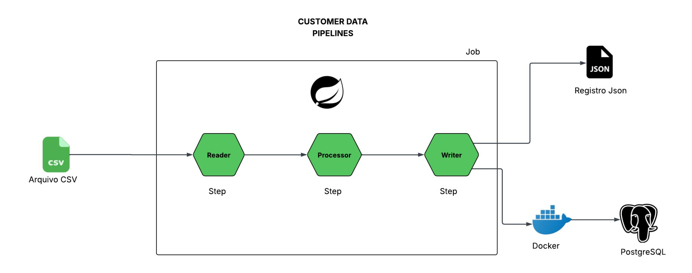

# 📊 Data-Pipeline

Este é um projeto de **ETL (Extract-Transform-Load)** desenvolvido em **Spring Boot**, com foco em automação de pipelines de dados e integração com banco de dados. O objetivo deste repositório é extrair dados de um arquivo CSV, transformá-los conforme regras de negócio e **carregar os dados processados em um destino (como um banco de dados relacional e arquivo JSON)**.

---
O **Data-Pipeline** é uma aplicação backend construída com **Spring Boot** para implementar um fluxo completo de ETL esperado em sistemas de engenharia de dados. Ele abstrai a lógica de ingestão, transformação e carga de dados, facilitando:
* Reuso de lógica de processamento
* Agendamento de jobs ETL
* Conexão com diferentes bancos de dados

---
<p align="center">
  
</p>

---

### 📌 Descrição da Demonstração

* Inicialização do pipeline ETL
* Execução do processo de extração dos dados
* Aplicação das regras de transformação
* Persistência dos dados processados no banco de dados
* Logs de execução para acompanhamento do processo

---

## 🚀 Tecnologias

O projeto utiliza as seguintes tecnologias:

* **Java 21+**
* **Spring Boot**
* **Spring Batch / Scheduler** *(se aplicável)*
* **Spring Data JPA / JDBC** *(conforme o projeto)*
* **Maven** para build e dependências
* **Banco de dados**: `PostgreSQL`

---

## 🧠 Arquitetura & Fluxo de Dados

O pipeline segue o padrão tradicional **ETL**:

1. **Extract** – Extração de dados de uma fonte (arquivo, API, DB)
2. **Transform** – Regras de negócio e conversões
3. **Load** – Inserção dos dados transformados no destino

💡 O fluxo pode ser visualizado assim:

```
[Fonte de Dados] → [Reader Spring Batch / Service de ingestão] → 
[Processor (transformação)] → [Writer / Repositório JPA] → [Destino]
```

---

## ⚙️ Como Rodar o Projeto

### 🧾 Pré-requisitos

1. **JDK 21+** instalado
2. **Maven**
3. **PostgreSQL** 
4. **Docker**

```bash
# Clonar o repositório
git clone https://github.com/Paulocarneiroo/Data-Pipeline.git
cd Data-Pipeline

# Construir o projeto
mvn clean install
```

### ▶️ Executar localmente

```bash
# Com Maven
mvn spring-boot:run

# Ou no JAR gerado
java -jar target/<nome-do-jar>.jar
```

---

## 🧩 Estrutura do Projeto

| Pasta                | Descrição                         |
| -------------------- | --------------------------------- |
| `src/main/java`      | Código-fonte principal            |
| `src/main/resources` | Configurações, arquivos estáticos |
| `controller`         | Endpoints (se houver APIs)        |
| `service`            | Serviços de negócio               |
| `batch`              | Jobs e Steps (Spring Batch)       |
| `repository`         | Interfaces de acesso a dados      |

---

